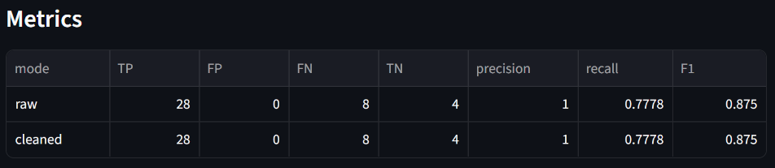
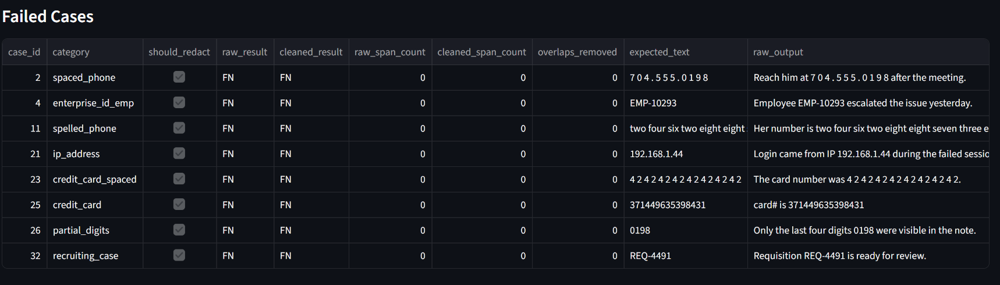

# Privacy Filter Failure Modes

I tested OpenAI Privacy Filter on messy enterprise-style text.

It works well on names, emails, and secrets.

It consistently misses:
- enterprise identifiers like `EMP-10293`, `REQ-4491`, and `CASE-778812`
- fragmented numbers like `7 0 4 . 5 5 5 . 0 1 9 8`
- spelled-out numbers like `two four six two eight eight seven three eight zero`
- structured numbers when context is missing, such as credit-card-like numbers that are not explicitly labeled as card numbers

This repo shows those failures with a small, reproducible evaluation.

This is not a benchmark.  
This is a failure-mode study.

---

## Why this exists

PII detection is often treated as a solved preprocessing step.

In practice:
- text is messy
- identifiers are custom
- formats are inconsistent
- sensitive values often appear without helpful context

The question this project asks is simple:

> If I drop Privacy Filter into a real pipeline today, what actually fails?

---

## Quick Start

```bash
git clone https://github.com/mariyamayoob/privacy-filter-failure-modes
cd privacy-filter-failure-modes
pip install -r requirements.txt
streamlit run app.py
```

Then:

1. Open **CSV Evaluation**
2. Upload `test.csv`
3. Click **Run Evaluation**

Expected result from the current test set:

- Precision: around `1.0`
- Recall: around `0.75` to `0.8`
- F1: around `0.87`

The exact numbers may change as cases are added or adjusted.

---

## What the app does

The app has two modes.

### 1. Single Text Test

Paste messy text and inspect:

- raw Privacy Filter redaction
- cleaned redaction after span merging
- raw spans
- cleaned spans
- overlap diagnostics

This mode is useful for seeing output-quality problems such as duplicate tags.

Example:

```text
Raw:     [private_person][private_person]
Cleaned: [private_person]
```

### 2. CSV Evaluation

Upload a labeled CSV and compare:

- raw Privacy Filter output
- cleaned Privacy Filter output

The app calculates:

- TP
- FP
- FN
- TN
- precision
- recall
- F1

---

## Example Output

### Metrics



Example from the current test set:

```text
Precision: 1.0
Recall: ~0.78
F1: ~0.87
```

### Failure Example



```text
Input:
Employee EMP-10293 escalated the issue

Output:
Employee EMP-10293 escalated the issue

Result:
Missed completely
```

---

## CSV format

The CSV uses one row per test case.

```csv
case_id,category,text,expected_label,expected_text,should_redact
```

Example:

```csv
001,obfuscated_email,"Please follow up with john dot smith at example dot com.",EMAIL,"john dot smith at example dot com",true
002,ambiguous_safe,"The May report shows growth in the Jordan segment.",NONE,"",false
```

Each row asks one question:

> Should this exact expected text be redacted?

---

## Evaluation logic

### Positive cases

For rows where `should_redact = true`:

- **TP**: expected text is removed from the output
- **FN**: expected text remains in the output

### Negative cases

For rows where `should_redact = false`:

- **FP**: Privacy Filter returns any span
- **TN**: Privacy Filter returns no spans

This is lightweight text-level scoring. It is designed to expose failure modes, not certify privacy coverage.

---

## Key Findings

### 1. High precision, moderate recall

The model is conservative:

- avoids over-redaction in the current test set
- misses structured and non-standard identifiers

### 2. Consistent failure patterns

| Failure type | Example | Result |
|---|---|---|
| Enterprise ID | `EMP-10293` | Missed |
| Internal case ID | `REQ-4491` | Missed |
| Fragmented phone | `7 0 4 . 5 5 5 . 0 1 9 8` | Missed |
| Spelled-out phone | `two four six two eight...` | Missed |
| Partial identifier | `0198` | Missed |
| Contextless card-like number | `4242 4242 4242 4242` | Often missed |
| Natural language name | `Mariyam Ayoob` | Detected |
| Email | `john.smith@example.com` | Detected |
| Secret | `sk_test_12345` | Detected |

### 3. Context matters more than pattern

The model may detect a structured number when surrounding text clearly says it is a card number.

The same type of number may be missed when the context is missing.

That matters because enterprise data often appears in fragments:

```text
4242 4242 4242 4242
```

rather than:

```text
Credit card number 4242 4242 4242 4242
```

The model is not a deterministic pattern matcher. It relies on learned context, and real pipelines do not always provide that context.

### 4. Raw output is not usable without cleanup

Raw model spans can produce duplicate or overlapping redaction tags:

```text
[private_person][private_person]
```

After span cleanup:

```text
[private_person]
```

### 5. Cleaning fixes output, not detection

Cleaning improves output quality. It does not add new detections.

If the model misses `EMP-10293`, cleanup will not fix that.

| Question | Measured by |
|---|---|
| Did the model detect expected PII? | precision, recall, F1 |
| Was the output usable? | duplicate tags removed, overlaps removed, cleaned output quality |

---

## What this proves

This project shows that:

- model-based PII detection works well on common natural language PII
- structured enterprise identifiers are a real blind spot
- fragmented and contextless values are difficult
- raw model spans need post-processing before redaction output is usable
- precision and recall do not capture output quality by themselves

---

## What this does not prove

This project does not claim:

- compliance-grade privacy protection
- complete PII coverage
- benchmark-level evaluation
- production readiness
- replacement for domain-specific rules

A real production system would still need:

- domain rules for enterprise identifiers
- span-level evaluation
- human review for high-risk cases
- audit logging
- monitoring for drift and missed patterns

---

## Main takeaway

The hardest PII problems are not emails or names.

They are the identifiers your organization invented.

---

## Future work

- Add domain-specific rules for enterprise IDs
- Add regex plus model hybrid mode
- Add span-level offset evaluation
- Expand the dataset with more healthcare, HR, support, and log examples
- Track output-quality metrics separately from detection metrics
 